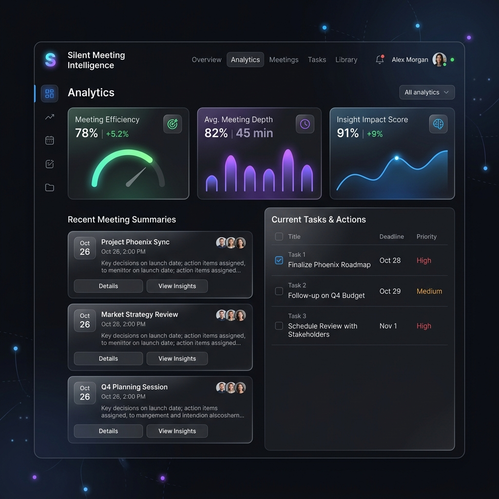

# Silent Meeting Intelligence 🎙️

> Transform your meeting recordings into structured, actionable intelligence using a production-grade 5-agent AI pipeline. Perfect for team handoffs, client calls, and automated meeting indexing.



---

## 🚀 What It Does

Upload any meeting audio or video. Get back:

| Output Component | Agent Responsible | Description |
|---|---|---|
| 📋 **Executive Summary** | `generate_summary` | Clean 3–5 sentence executive summary of the meeting context |
| ✅ **Decisions** | `extract_decisions` | Every agreement, confirmed plan, and direction finalized |
| 🎯 **Action Items** | `extract_action_items` | Specific tasks assigned to owners with deadlines and priorities |
| ❓ **Open Questions** | `extract_open_questions` | Uncertainties, unresolved topics, or follow-up items |
| 📧 **Follow-up Email** | `generate_email_draft` | Professional, copy-pasteable Markdown email draft for stakeholders |
| ⚠️ **Cross-Meeting Conflicts** | `detect_conflicts` | Semantic alerts comparing new decisions against past meetings |

---

## 🛠️ Architecture

```mermaid
graph TD
    A[Meeting Recording .mp3/.wav/.mp4] --> B[Groq Whisper API]
    B -->|transcribe| C[Raw Transcript]
    C --> D[5-Node LangGraph State Machine]
    
    subgraph LangGraph Pipeline
        D --> E[extract_decisions]
        E --> F[extract_action_items]
        F --> G[extract_open_questions]
        G --> H[generate_summary]
        H --> I[generate_email_draft]
    end

    I -->|save results| J[(SQLite Database)]
    J --> K[FastAPI Backend]
    
    subgraph Advanced Features
        K --> L[Meeting Chatbot Tab]
        K --> M[Lexical RAG Search Console (TF-IDF)]
        K --> N[Cross-Meeting Conflict Detector]
        K --> O[FPDF2 PDF Report Generator]
    end
    
    L & M & N & O --> P[Streamlit UI Dashboard]
```

---

## 🌐 Tech Stack & Infrastructure

- **Speech-to-Text**: Groq Whisper API (`whisper-large-v3-turbo`)
- **Agent Orchestration**: LangGraph (Stateful, deterministic state machine)
- **Large Language Model**: LLaMA 3.3 70B via Groq Cloud API
- **Web Backend**: FastAPI (Asynchronous, type-safe, auto-documenting)
- **Database**: SQLite + SQLAlchemy ORM (Single-file database, zero configuration)
- **Frontend Dashboard**: Streamlit (Rich UI with custom glassmorphism styling)
- **PDF Generation**: `fpdf2` (Pure Python, zero-binary dependency)

---

## ⚙️ Quick Start

### 1. Get a Free Groq API Key
Sign up at [console.groq.com](https://console.groq.com) and create an API Key (free, no credit card required).

### 2. Configure Environment
Clone the repository and copy `.env.example`:
```bash
cp .env.example .env
# Edit .env and paste your GROQ_API_KEY
```

### 3. Install Dependencies
```bash
pip install -r requirements.txt
```

### 4. Run the Backend
```bash
python run_backend.py
```
- Backend API: http://localhost:8001
- Interactive OpenAPI Docs: http://localhost:8001/docs

### 5. Run the Streamlit Dashboard
```bash
streamlit run dashboard/app.py
```
- Dashboard UI: http://localhost:8501

---

## 🧠 Architectural Trade-offs (Interview Ready)

### 1. Database: SQLite vs. PostgreSQL
*   **Choice**: SQLite.
*   **Rationale**: SQLite requires zero installation, runs in-memory or in a single file, and easily supports hundreds of concurrent reads for single-tenant or team-internal portfolios.
*   **Scale-out path**: If we scale horizontally to multiple server instances, SQLite's file lock will fail. In `backend/database.py`, swapping to PostgreSQL is a single-line database connection string change: SQLAlchemy handles all schema mapping abstractly.

### 2. State Machine: LangGraph vs. Autogen/CrewAI
*   **Choice**: LangGraph.
*   **Rationale**: Multi-agent systems like CrewAI or Autogen are highly autonomous and non-deterministic, making them prone to infinite loops and unpredictable execution times. For business-critical meeting extraction, we need **consistency, auditability, and deterministic flow**. LangGraph enables explicit state modeling where each extraction step runs in sequence, is individually testable, and has structured inputs/outputs.

### 3. Transcription: Groq Whisper Cloud API vs. Local Whisper
*   **Choice**: Groq Cloud API.
*   **Rationale**: Running a Whisper model locally on a CPU takes 2–5x real-time (a 10-minute meeting would take up to 50 minutes to transcribe). Groq's cloud-hosted LPUs complete transcription of the same audio file in under 5 seconds. This keeps server resources low and keeps deployment within free-tier container limits.

### 4. Security: Simple API Key Header vs. OAuth2/JWT
*   **Choice**: Header-based `X-API-Key` secret.
*   **Rationale**: Full OAuth2/JWT authentication adds user signup tables, token storage, expiry, and state management. For a single-tenant portfolio utility, a secure, rotation-friendly API key passed in headers is simpler, faster, and equally secure.

---

## 🎓 Placement Prep: Common Interview Q&As

#### Q: How does the async backend handle long-running meeting audio without blocking the UI?
> **Answer**: When a file is uploaded to `POST /meetings/upload`, FastAPI validates the format and instantly spawns a `BackgroundTasks` thread before returning a `202 Accepted` status along with a `meeting_id`. The UI immediately starts polling the backend status using `GET /meetings/{id}` every 3 seconds. The backend does all transcription and agent analysis on the background worker thread, ensuring the main server thread never hangs.

#### Q: How does your Lexical RAG Search (TF-IDF) retrieve relevant snippets across multiple meetings without a Vector DB?
> **Answer**: To avoid the setup overhead of a dedicated Vector Database (like Pinecone/Weaviate) for a portfolio app, I implemented a lightweight, memory-efficient **TF-IDF (Term Frequency-Inverse Document Frequency) keyword ranker** directly in Python. It splits all historical transcripts into paragraph chunks, calculates keyword-matching relevance scores against the user's search query, selects the top 5 most relevant snippets, and feeds them as cited context into LLaMA 3.3 to synthesize a unified answer.

#### Q: Why did you split the AI analysis into 5 separate agents instead of one big prompt?
> **Answer**: Running a single prompt to extract everything (summary, decisions, actions, email) introduces **context confusion** and leads to missing details (especially for longer transcripts). By breaking it into 5 distinct LangGraph nodes, we achieve two major benefits:
> 1. **Focus**: Each prompt is highly specialized, increasing extraction accuracy.
> 2. **Pipelining**: The `generate_email_draft` node reads from the shared `MeetingState` only after previous nodes have populated `decisions` and `action_items`, ensuring the email is consistently correct.

#### Q: How does cross-meeting conflict detection work?
> **Answer**: When a meeting completes processing, we extract its decisions. We query the SQLite database for decisions from all *past* meetings and send both sets to LLaMA 3.3. The LLM performs a semantic comparison (e.g., detecting if "Migrate to MongoDB" contradicts a past decision "PostgreSQL is our primary DB") and flags contradictions in the UI, helping teams prevent conflicting roadmaps.
